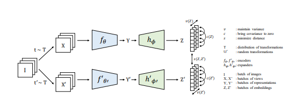

# VICReg: Variance-Invariance-Covariance Regularization for Self-Supervised Learning
An easy-to-use implementation of [VICReg](https://arxiv.org/abs/2105.04906) in Pytorch.




### Installation
To rerun experiments or try on your own dataset, first clone the repository and install `requirements.txt`.
```
$ pip install -r requirements.txt
```

### Train VICReg
To train model use `train.py`.

```
$ python train.py --path path/to/your/dataset/ 
```

### VICReg implementation
- [X] 3 different loss function 
- [X] VICReg model and training loop
- [ ] Implementation for multiple GPUs
- [ ] Compare results with paper

### Any contribution is appreciated!
